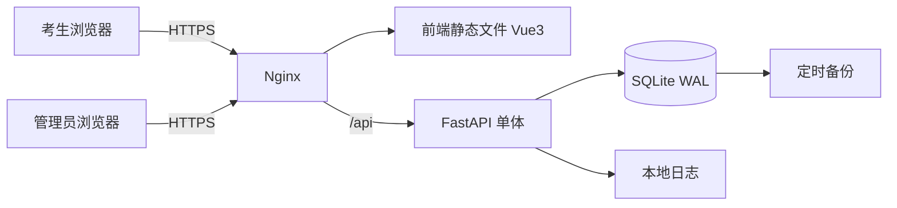

# 极轻量级客观题考试系统 — 技术架构

> 场景：内网服务器、练习/自测、50–200 人同时在线  
> 核心原则：考试中零前后端交互，交卷时一次性提交，服务端判分，管理员导出成绩线下告知。

---

## 1. 需求约束

- 同时在线：50–200 人
- 考试性质：练习/自测
- 进入方式：一人一码，一场考试一个邀请码，线下分发
- 登录方式：手机号 + 邀请码
- 题型：单选、多选、判断
- 多选判分：选错 0 分，漏选按比例给分，保留 1 位小数
- 组卷方式：题库 + 标签；管理员选标签和每标签题数，系统随机抽题；发布时生成试卷快照
- 限时方式：整场统一开考时间、统一截止时间；晚进少考；前端倒计时按 `end_at` 计算；到点强制交卷
- 出分方式：交卷后不立即出分，管理员导出 CSV 线下告知；考生交卷后不可再登录查看
- 断线续考：答案存前端 IndexedDB；刷新/断网可恢复；换设备/清缓存答案丢失，从空白继续；不做设备锁
- 考试中交互：零前后端交互；交卷时一次性提交全部答案
- 提交失败：前端保留答案，自动重试 3 次，提供手动重试按钮
- 题目内容：纯文本
- 管理端：题库管理、组卷、发布、成绩导出、统计图表
- 统计图表：平均分、及格率、题目标错率
- 管理员登录：账号 + 密码（环境变量配置，单个超管），独立管理员页面

---

## 2. 架构结论

**推荐架构：**

> Vue3 + FastAPI + SQLite WAL + Docker Compose + Nginx，内网单机部署。

**核心特征：**

- 考试中零后端交互
- 答案只存前端 IndexedDB
- 交卷时一次性 POST 提交
- 服务端统一判分
- 管理员导出成绩，线下告知
- 不用 Redis、MQ、微服务、K8s

---

## 3. 架构图



---

## 4. 技术栈

| 层 | 选型 |
|---|---|
| 前端 | Vue3 + Vite + TypeScript |
| 本地存储 | IndexedDB |
| 后端 | FastAPI + SQLModel |
| 数据库 | SQLite，开启 WAL，`busy_timeout=5000` |
| 反向代理 | Nginx |
| 部署 | Docker Compose |
| 图表 | ECharts |
| 导出 | 后端生成 CSV |

**明确不用：** Redis、MQ、微服务、K8s。

---

## 5. 核心流程

1. 管理员创建考试草稿，填写：考试名称、选聘编号、开考时间、截止时间、及格比例、组卷规则。
2. 管理员导入考生 CSV（手机号、姓名、身份证号），点击“生成邀请码”，系统为每人生成全局唯一 6 位数字码。
3. 管理员发布考试：按组卷规则随机抽题，生成 `exam_questions` 快照，题目顺序随机固定。
4. 管理员导出邀请码列表，线下分发。
5. 考生在考试时间窗口内，用手机号 + 邀请码登录。
6. 到开考时间后，考生点击“开始考试”，创建 attempt，拉取试卷。
7. 考试中答案只存 IndexedDB，零后端交互。
8. 截止时间到，前端强制交卷；考生也可提前交卷。
9. 交卷一次性 POST，服务端事务内判分，写入成绩。
10. 管理员后台查看统计图表，导出 CSV，线下告知成绩。

---

## 6. 数据模型

```sql
users(
  id            INTEGER PRIMARY KEY,
  name          TEXT NOT NULL,
  phone         TEXT NOT NULL,
  id_card       TEXT NOT NULL UNIQUE,
  created_at    DATETIME NOT NULL
)

exams(
  id              INTEGER PRIMARY KEY,
  title           TEXT NOT NULL,
  recruitment_no  TEXT NOT NULL UNIQUE,
  status          TEXT NOT NULL DEFAULT 'draft',
  start_at        DATETIME NOT NULL,
  end_at          DATETIME NOT NULL,
  pass_ratio      INTEGER NOT NULL,
  settings_json   TEXT NOT NULL DEFAULT '{}',
  created_at      DATETIME NOT NULL,
  published_at    DATETIME
)

exam_candidates(
  id            INTEGER PRIMARY KEY,
  exam_id       INTEGER NOT NULL,
  user_id       INTEGER NOT NULL,
  invite_code   TEXT NOT NULL UNIQUE,
  created_at    DATETIME NOT NULL,
  UNIQUE(exam_id, user_id)
)

questions(
  id            INTEGER PRIMARY KEY,
  type          TEXT NOT NULL,
  stem          TEXT NOT NULL,
  options_json  TEXT NOT NULL,
  answer_json   TEXT NOT NULL,
  score         REAL NOT NULL,
  tags_json     TEXT NOT NULL,
  analysis      TEXT DEFAULT '',
  updated_at    DATETIME NOT NULL
)

exam_questions(
  exam_id       INTEGER NOT NULL,
  question_id   INTEGER NOT NULL,
  seq           INTEGER NOT NULL,
  score         REAL NOT NULL,
  PRIMARY KEY(exam_id, question_id)
)

attempts(
  id              INTEGER PRIMARY KEY,
  exam_id         INTEGER NOT NULL,
  user_id         INTEGER NOT NULL,
  started_at      DATETIME NOT NULL,
  submitted_at    DATETIME,
  score           REAL,
  status          TEXT NOT NULL,
  switch_count    INTEGER NOT NULL DEFAULT 0,
  switch_log_json TEXT NOT NULL DEFAULT '[]',
  UNIQUE(exam_id, user_id)
)

answers(
  id            INTEGER PRIMARY KEY,
  attempt_id    INTEGER NOT NULL,
  question_id   INTEGER NOT NULL,
  answer_json   TEXT NOT NULL,
  is_correct    INTEGER NOT NULL,
  score         REAL NOT NULL,
  UNIQUE(attempt_id, question_id)
)
```

**关键约束：**

- `users.id_card` 全局唯一。
- `exams.recruitment_no` 全局唯一，字母数字，必填。
- `exam_candidates.invite_code` 全局唯一，6 位数字。
- `attempts(exam_id, user_id)` 唯一，一人一场考试一个 attempt。
- `answers(attempt_id, question_id)` 唯一。
- API 返回试卷时绝不带 `answer_json`。
- 重复提交同一 `attempt` 返回已有结果，保证幂等。

---

## 7. API 草案

### 7.1 考生端

```http
POST /api/auth/join
Body: { phone, invite_code }
Resp: { token, exam: { id, title, start_at, end_at } }
# 校验手机号+邀请码，校验考试时间窗口
# 已交卷再次登录：409 "你已交卷，考试结束"

GET /api/exams/{id}/paper
Header: Authorization
Resp: { exam, questions: [{ id, type, stem, options }] }
# 不含 answer_json，不含 analysis
# 仅进行中可拉取

POST /api/exams/{id}/attempts
Header: Authorization
Resp: { attempt_id, end_at }
# 创建 attempt，若已存在则返回已有 attempt_id
# 仅进行中可创建

POST /api/attempts/{id}/submit
Header: Authorization
Body: {
  answers: [{ question_id, answer: ["A","B"] }],
  switch_count: 3,
  switch_log: ["2026-09-19T10:01:23", ...]
}
Resp: { ok: true }
# 事务内判分，幂等
# 服务端校验是否超时，超时标记 timeout_submitted
```

### 7.2 管理员端

```http
POST /api/admin/login
Body: { username, password }
Resp: { token }

# 题库
GET    /api/admin/questions?type=&tag=&keyword=
POST   /api/admin/questions              # 单题新增
PUT    /api/admin/questions/{id}         # 单题编辑
DELETE /api/admin/questions/{id}         # 单题删除
POST   /api/admin/questions/import       # JSON 批量导入，按 id upsert

# 考试
GET    /api/admin/exams
POST   /api/admin/exams                  # 创建草稿
PUT    /api/admin/exams/{id}             # 仅草稿可改
DELETE /api/admin/exams/{id}             # 仅草稿可删
POST   /api/admin/exams/{id}/publish     # 发布，生成快照
POST   /api/admin/exams/{id}/archive     # 归档

# 名单
POST   /api/admin/exams/{id}/candidates/import   # CSV 导入
POST   /api/admin/exams/{id}/candidates/generate # 生成邀请码，全部覆盖，二次确认
GET    /api/admin/exams/{id}/candidates/export   # 导出邀请码 CSV

# 成绩
GET    /api/admin/exams/{id}/results             # 成绩列表
GET    /api/admin/exams/{id}/results/export      # 导出成绩 CSV
GET    /api/admin/exams/{id}/stats               # 统计图表数据
```

**注意：** 考试中不设计保存答案接口，因为已确定零前后端交互。考生交卷后无查分接口。

---

## 8. 判分规则

- 单选：完全匹配得满分，否则 0 分。
- 判断：完全匹配得满分，否则 0 分。
- 多选：
  - 不选：0 分。
  - 选了任何错误选项：0 分。
  - 只选正确选项但漏选：`得分 = 满分 × (选对数量 / 正确选项总数)`。
  - 保留 1 位小数，四舍五入。

**示例：** 正确答案 ABC，满分 10 分。
- 选 AB → 10 × 2/3 = 6.7
- 选 A → 10 × 1/3 = 3.3
- 选 ABCD → 0
- 选 AD → 0

**要求：**

- 判分只在服务端进行。
- 判分规则配置化，便于调整。
- 交卷时在事务中完成判分和成绩写入。

---

## 9. 关键设计

### 9.1 统一截止时间

- 服务端存 `exam.start_at`、`exam.end_at`。
- 前端倒计时按 `end_at` 计算。
- 交卷时服务端校验是否超时，超时标记 `timeout_submitted`，正常判分。
- 晚进少考：考生进入时若已过 `start_at`，仍可开始，倒计时按 `end_at` 计算。

### 9.2 考试状态机

数据库只存人工状态：`draft` / `published` / `archived`。对外状态由后端惰性计算：

| 条件 | 对外状态 |
|---|---|
| `status = draft` | 草稿 |
| `status = published` 且 `now < start_at` | 未开始 |
| `status = published` 且 `start_at <= now <= end_at` | 进行中 |
| `status = published` 且 `now > end_at` | 已结束 |
| `status = archived` | 已归档 |

缺考不存状态，导出时拿 `exam_candidates` 左连 `attempts` 动态算。不需要定时任务。

### 9.3 发布即冻结

- 草稿状态可自由修改：组卷、时间、名单、邀请码、选聘编号。
- 发布后全冻结：不能改名单、不能重生成邀请码、不能改组卷、不能改时间。
- 要修改只能删除重建。
- 草稿可删除。

### 9.4 断线续考

- 答案存 IndexedDB。
- 刷新/断网/浏览器崩溃：答案和倒计时恢复，继续答题。
- 换设备/换浏览器/清缓存：能登录同一 attempt，但本地答案丢失，从空白继续。
- 不做设备锁，管理员后台不需要解绑功能。

### 9.5 提交失败

- 前端保留全部答案。
- 自动重试 3 次，间隔 2s / 4s / 8s。
- 仍失败则显示“重试提交”按钮。
- 服务端保证幂等，重复提交不重复判分。

### 9.6 组卷快照

- 发布考试时随机抽题。
- 校验每个标签题数是否足够，不足直接报错，禁止发布。
- 抽题结果写入 `exam_questions`，题目顺序随机固定。
- 之后修改题库不影响已发布考试。

### 9.7 选项乱序

- 题目顺序全局固定，发布时随机确定。
- 选项顺序每个考生独立乱序，种子为 `手机号 + 邀请码`。
- 刷新后选项顺序不变。
- 提交原始选项 key（A/B/C/D），非显示位置。
- 判断题不打乱。

### 9.8 邀请码

- 6 位数字，全局唯一。
- 仅草稿状态可生成/重新生成，发布后冻结。
- 重新生成全部覆盖，需二次确认。
- 导入 CSV 表头：手机号、姓名、身份证号。
- 身份证号全局唯一，已存在则关联已有考生并更新姓名、手机号。

### 9.9 切屏记录

- 前端监听 `visibilitychange`，记录切屏时间点。
- 交卷时提交 `switch_count` 和 `switch_log`。
- 不中断考试。

### 9.10 统计

- 管理员端用 SQL 聚合。
- 指标：
  - 平均分：分母 = 所有有 attempt 的人。
  - 及格率：按得分排名取前 `pass_ratio%`，并列全部通过；分母 = 所有有 attempt 的人。
  - 题目标错率：得分 < 满分即算错，未作答也算错；分母 = 所有有 attempt 的人。
- ECharts 展示图表。
- 支持导出成绩 CSV，列：选聘编号、考试名称、手机号、姓名、身份证号、邀请码、开始时间、交卷时间、得分、是否及格、切屏次数、切屏时间点、状态（正常提交/超时提交/缺考）。缺考也出现，得分空。

---

## 10. 部署方案

```yaml
services:
  nginx:
    image: nginx
    ports:
      - "80:80"
      - "443:443"
    volumes:
      - ./nginx.conf:/etc/nginx/nginx.conf
      - ./dist:/usr/share/nginx/html
  app:
    build: .
    volumes:
      - ./data:/data
    environment:
      - ADMIN_USERNAME=admin
      - ADMIN_PASSWORD=changeme
```

**要点：**

- 内网单机部署。
- SQLite 文件放 `./data/exam.db`。
- SQLite 开启 WAL 和 `busy_timeout=5000`。
- Nginx 负责静态文件和 `/api` 反向代理。
- 内网 HTTPS 可用自签证书或内网 CA。
- 管理员账号密码从环境变量读取，仅一个超管。

---

## 11. 备份与恢复

- 每小时执行 SQLite `.backup`。
- 考试前手动备份一次。
- 备份文件复制到另一台机器或内网 NAS。
- 保留至少最近 7 天备份。
- 恢复流程需提前演练一次。

---

## 12. 风险与坑

- **SQLite 并发写**：200 人同时交卷，WAL 可扛，但建议加重试或简单队列。担心就换 PostgreSQL。
- **本地存储丢失**：清缓存、换设备就没了，已接受，从空白继续。
- **邀请码泄露**：练习场景可接受；可加登录限流。
- **提交失败**：必须有重试机制，前端自动重试 + 手动重试。
- **时间校验**：以服务端 `end_at` 为准，前端倒计时只是展示。
- **答案泄露**：API 绝不能下发 `answer_json`。
- **重复提交**：必须幂等。
- **切屏**：记录次数和时间点，交卷时提交，不中断考试。
- **无发布成绩流程**：考生交卷后不可再登录，管理员导出 CSV 线下告知。

---

## 13. 升级触发条件

| 触发条件 | 升级动作 |
|---|---|
| 同时在线 >300–500 | SQLite → PostgreSQL |
| 多实例部署 | PostgreSQL + Redis |
| 题目图片/音频多 | 对象存储 + CDN |
| 多机构/多学校 | 加 tenant_id + RBAC |
| 高利害正式考试 | 监考客户端、审计、SLA |
| 写入频繁锁库 | 批量保存 + PostgreSQL |
| 希望零运维 | Supabase / PocketBase |

---

## 14. 一句话总结

Vue3 + FastAPI + SQLite + Docker Compose，内网单机。考试中零交互，答案存 IndexedDB，交卷一次性提交，服务端判分。管理员导入名单、生成邀请码、发布考试、导出成绩，线下告知。